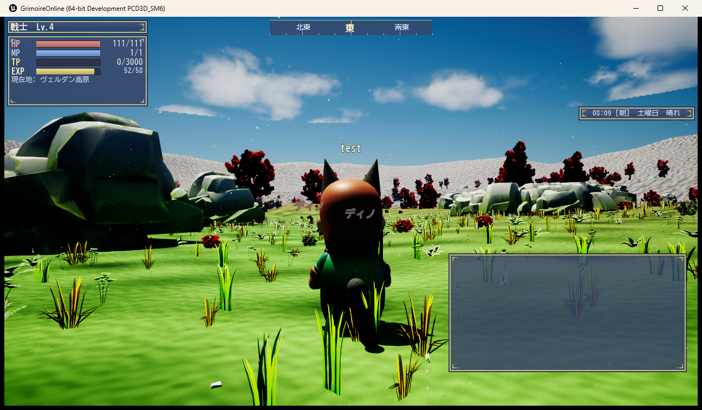

# Grimoire Online

自作MMORPG「Grimoire Online」のクライアント配布ページです。

## ダウンロード

最新版は **[Releases](../../releases/latest)** からどうぞ。

1. `GrimoireOnline_Setup.exe` をダウンロードして実行
2. インストール先を選んで進める(途中で「管理者の確認」が出たら「はい」)
3. デスクトップの「Grimoire Online」から起動
4. タイトル画面でアカウント名とパスワードを入力(初回は自動で新規登録されます)

ゲームのサーバーへの接続に必要なもの(Cloudflare WARP)はインストーラーが一緒に入れ、
自動でつながります。ネットワークの設定や別ソフトの操作は要りません。
WARP はこのゲームのサーバー宛ての通信だけを扱い、ほかの通信には触れません。

**すでに遊んでいる人へ:** 入れ直す必要はありません。今までの接続方式(ZeroTier)のまま遊べます。
ゲーム本体は起動時に自動で最新版に更新されます。

## 動作環境

- Windows 11 (64bit) のみ
- DirectX 12 対応GPU
- 空き容量 約2GB

## 遊び方(最初の一歩)

- WASD=移動 / マウス右ドラッグ=視点 / Tab=敵をターゲット / R=たたかう
- H=休憩 / P=そうび / I=もちもの / J=クエスト日誌 / M=地図
- 街の「!」マークのNPCからクエストを受けられます

## 注意

- サーバーの稼働時間内のみ遊べます(稼働状況はこのページでお知らせします)
- 個人開発の実験的なゲームです。データの巻き戻し等が起きることがあります

---
このリポジトリは配布専用です(ソースコードは含まれません)。
